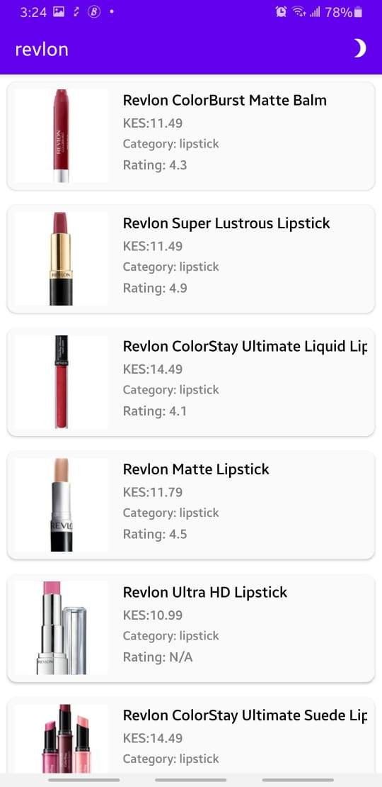
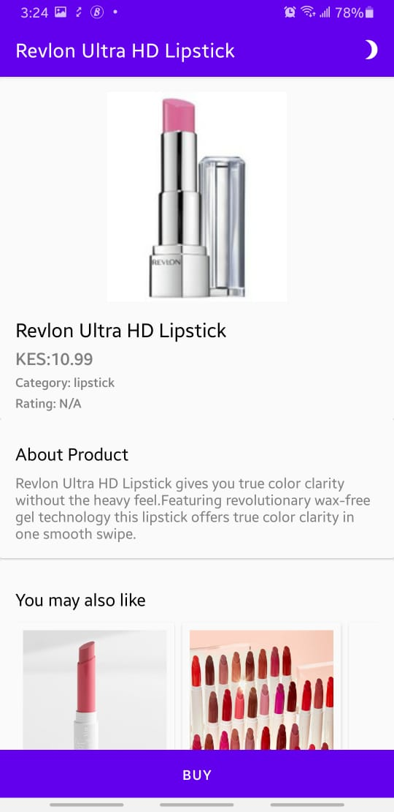
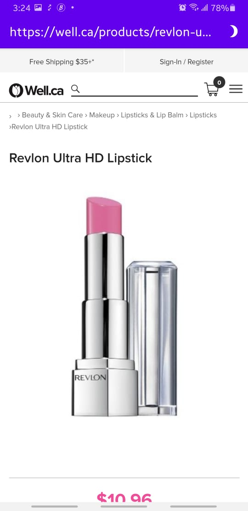
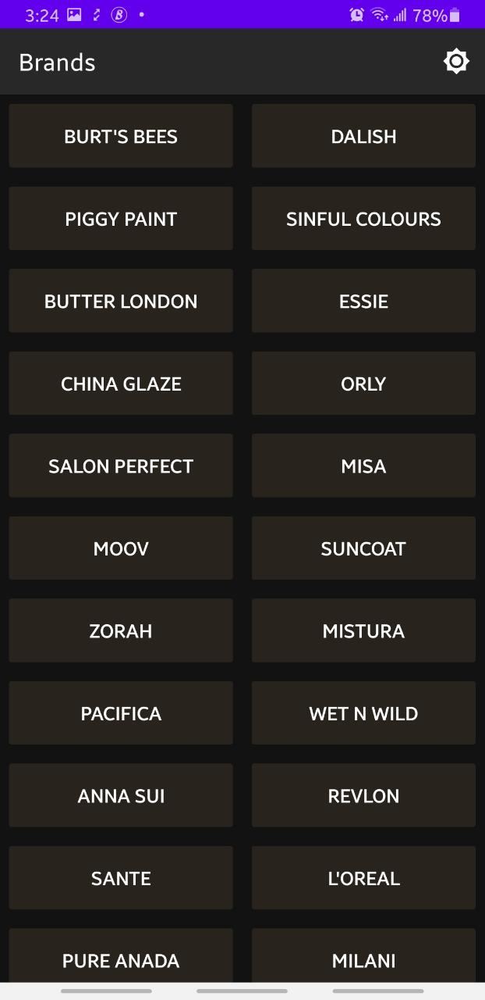

ABSA Android Take Home Assignment
==============

Writing the Make Up App challenge using [Android Architecture Components](https://developer.android.com/topic/libraries/architecture/), in 100% Kotlin :kotlin:

Requirements
----
Create an Android Make-up app, using the following API: ```http://makeup-api.herokuapp.com/api/v1/products.json```

The app should;
```
- Be written in Kotlin
- Use the MVVM pattern
- Use constraint layouts
```

The app should have the following basic functionality:
```
- Display make-up items by brand (Example, Revlon, Almay, Clinique etc)

- For each product within a specific make-up brand, distinguish between the different product types (Example for the Revlon brand: blush, cream, lipstick, lip liner, foundation etc)

- Once the user selects a make-up item, basic information such as the Name, Description, Price, and Image of the product should be displayed
```
You can also implement functionality for the web link.

How it's built
----

* Technologies used
  * [Kotlin](https://kotlinlang.org/)
  * [Coroutines](https://kotlinlang.org/docs/reference/coroutines-overview.html)
  * [Flow](https://kotlinlang.org/docs/reference/coroutines/flow.html)
  * [Retrofit](https://square.github.io/retrofit/) for network calls
  * [Chucker](https://github.com/ChuckerTeam/chucker) for analysing network traffic
  * [Jetpack](https://developer.android.com/jetpack)
    * [Lifecycle](https://developer.android.com/topic/libraries/architecture/lifecycle)
    * [ViewModel](https://developer.android.com/topic/libraries/architecture/viewmodel)
    * [DataStore](https://developer.android.com/topic/libraries/architecture/datastore)
    * [WorkManager](https://developer.android.com/topic/libraries/architecture/workmanager)
    * [View Binding](https://developer.android.com/topic/libraries/architecture/viewbinding)
    * [Room](https://developer.android.com/training/data-storage/room)
    * [Navigation Component](https://developer.android.com/guide/navigation)
  * [Timber](https://github.com/JakeWharton/timber) for logging
  * [Leak Canary](https://github.com/square/leakcanary) to detect memory leaks
  * [Dagger Hilt] [11] for dependency injection

[11]: https://developer.android.com/training/dependency-injection/hilt-android

* Architecture
  * MVVM - Model View View Model

* Tests
  * [JUnit4](https://junit.org/junit4/)

* Plugins
  * [Dokka](https://github.com/Kotlin/dokka)
  * [jacoco](https://github.com/jacoco/jacoco)
  * [ktlint](https://github.com/JLLeitschuh/ktlint-gradle)
  * [Detekt](https://github.com/detekt/detekt)

* CI/CD
  * [Gitlab CI](https://about.gitlab.com/stages-devops-lifecycle/continuous-integration/)

### Screenshots

I added some screenshots in the `screenshots` folder, in the root directory of the project.

Brands Screen
---


Products Screen
---


Single Product Screen
---


Web Link Screen
---


Dark Mode View
---
